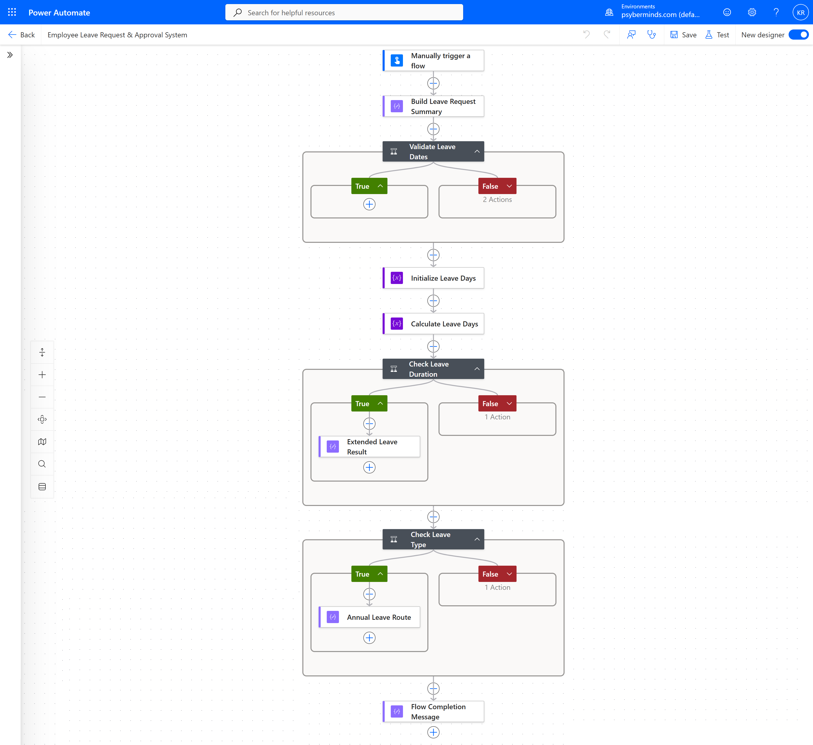

# Power-Automate-Employee-Leave-Approval
Employee leave request validation and approval routing workflow built with Microsoft Power Automate.

## Workflow Screenshot

The following screenshot shows the complete Power Automate workflow, including date validation, leave-day calculation, approval routing, and leave-type classification.

# Employee Leave Approval System .. Microsoft Power Automate

A Microsoft Power Automate workflow that validates employee leave requests, calculates leave duration, and routes requests based on business rules.

## Project Overview

This project demonstrates how Microsoft Power Automate can be used to automate an employee leave request process.

The workflow accepts employee leave information, validates the requested dates, calculates the number of leave days, and applies conditional business rules to determine the appropriate approval route.

## Workflow Features

- Manual leave request submission
- Employee and leave information capture
- Leave date validation
- Automatic leave duration calculation
- Inclusive date calculation
- Standard vs extended leave routing
- Leave type classification
- Invalid request termination
- Conditional branching
- Run-after configuration
- Tested boundary and error scenarios

## Business Rules

The workflow currently implements the following rules:

- The End Date must be greater than or equal to the Start Date.
- Invalid date ranges are rejected and the flow is terminated.
- Leave requests of 5 days or fewer follow the standard Manager approval route.
- Leave requests longer than 5 days follow the Manager + HR approval route.
- Annual Leave follows the standard annual leave policy.
- Other leave types are flagged for additional leave-type review.

## Workflow

Employee Leave Request  
→ Build Request Summary  
→ Validate Leave Dates  
→ Calculate Leave Days  
→ Check Leave Duration  
→ Determine Approval Route  
→ Check Leave Type  
→ Complete Processing

## Technologies

- Microsoft Power Automate
- Power Automate Expressions
- Microsoft 365 / Power Platform
- GitHub

## Current Limitations

The core workflow logic is implemented and tested.

External integrations such as SharePoint persistence and email notifications could not be enabled in the development environment because cross-tenant connections were restricted by the environment's tenant isolation policy.

These integrations can be added in an environment with the appropriate Microsoft 365 permissions and connector policies.

## Future Improvements

- Store leave requests in a SharePoint List
- Integrate Microsoft Approvals
- Send approval and rejection notifications
- Replace the manual trigger with Microsoft Forms or another request interface
- Add approval status tracking
- Add reporting and analytics

## Project Status

Core workflow logic: **Complete**

External Microsoft 365 integrations: **Planned / Environment dependent**
